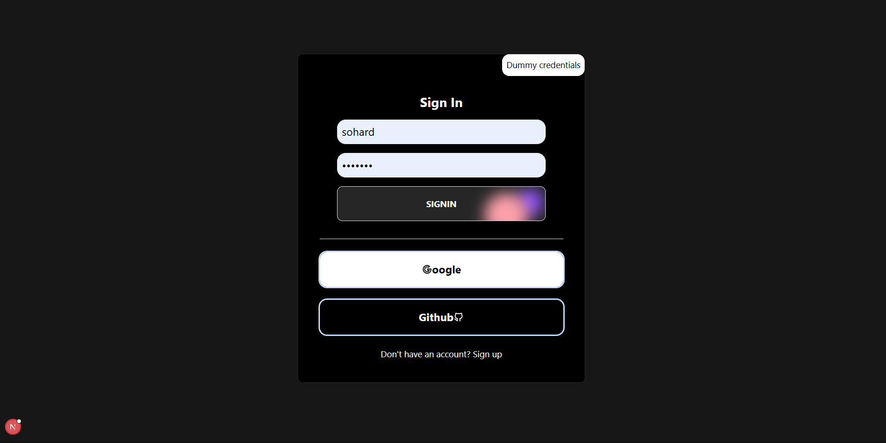
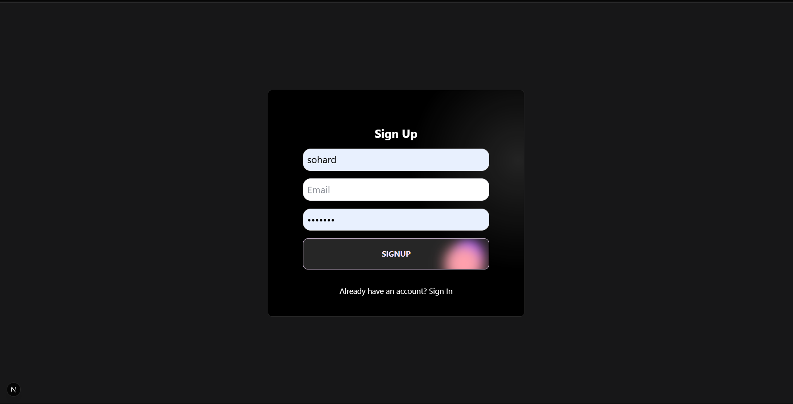
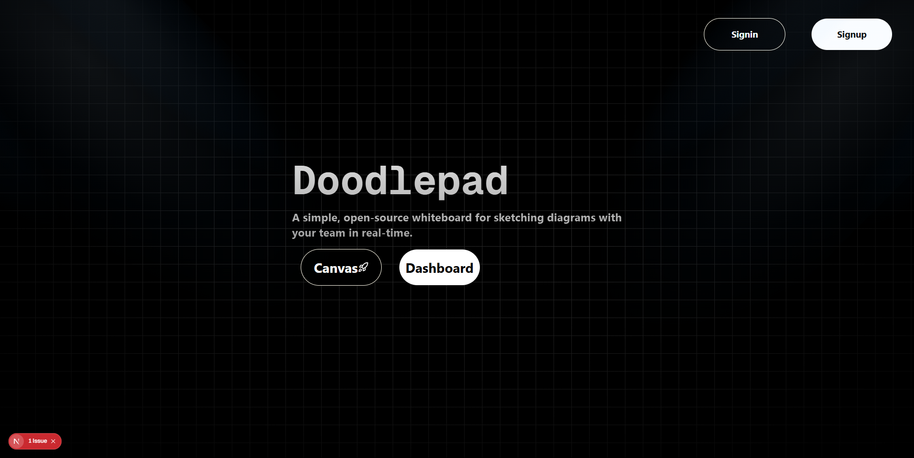
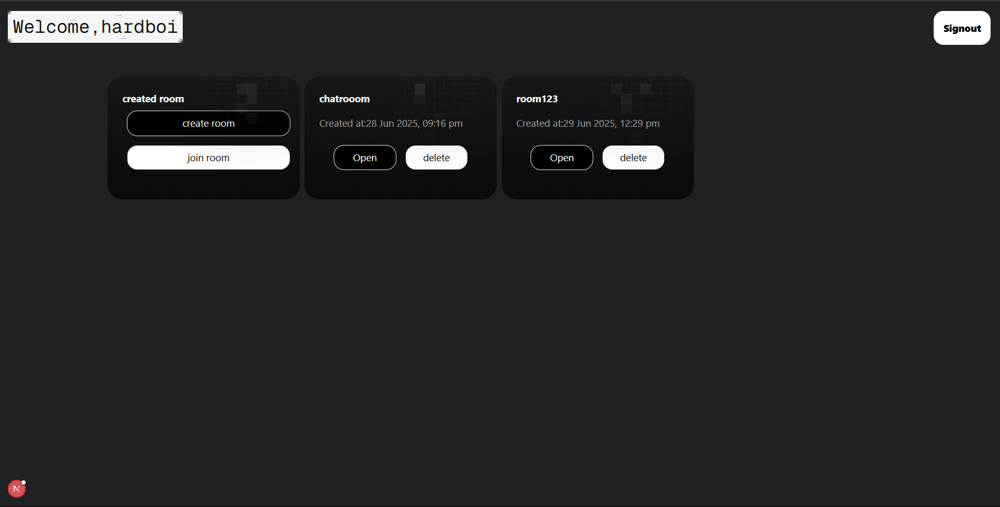
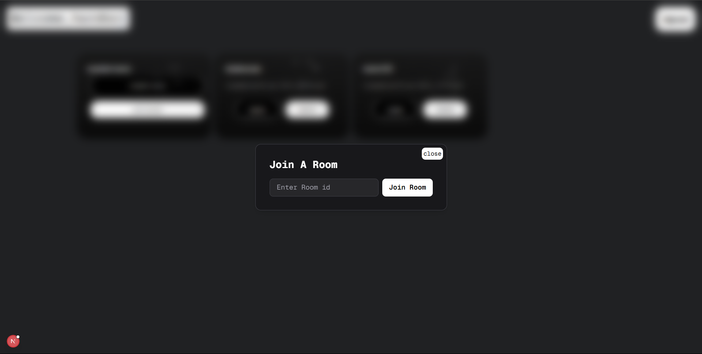
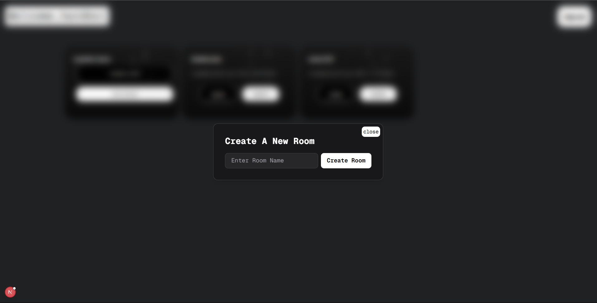
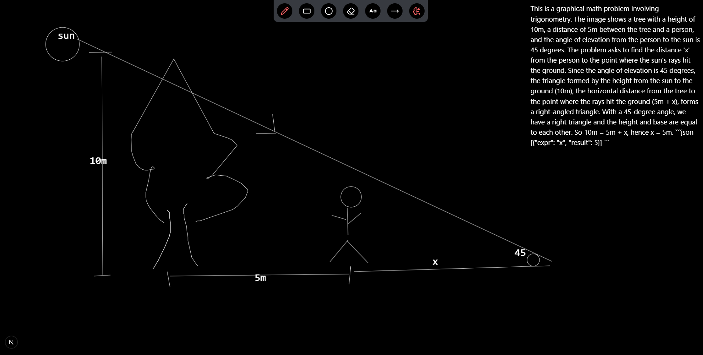

# Doodlepad

**Doodlepad** is a simple, open-source virtual whiteboard for sketching diagrams with your team in real-time. Built with modern web technologies, Doodlepad offers a seamless collaborative experience—perfect for brainstorming, teaching, or any scenario where visual thinking shines.

> Doodlepad is a virtual collaborative whiteboard tool that lets you easily sketch diagrams that have a hand-drawn feel to them.

---

## ✨ Features

- **Real-Time Collaboration:** Draw together with your team instantly in shared rooms.
- **Hand-Drawn Feel:** Diagrams and sketches look natural—just like a real whiteboard!
- **Intuitive Tools:** Use pencil, eraser, rectangle, line, circle, and more—all from a custom-built canvas (no external libraries).
- **Room Management Dashboard:**
  - Create a new room
  - Join existing rooms
  - View & access all your rooms in one place
- **Authentication:** Powered by NextAuth for secure access and personalized experience.

---

## 🛠️ Tech Stack

- **Framework:** [Next.js](https://nextjs.org/) (App Router)
- **Realtime:** WebSockets for instant updates
- **AI Integration:** Gemini AI
- **Monorepo:** Turborepo
- **Database:** Prisma ORM
- **Networking:** Axios
- **Styling:** Tailwind CSS + [Aceternity UI Components](https://ui.aceternity.com/)
- **Authentication:** NextAuth
- **Canvas:** Custom implementation (no third-party libraries)
- **Package Manager:** pnpm

---

## 🚀 Getting Started

1. **Clone the repository**
   ```bash
   git clone https://github.com/Sohardbegraj/Doodlepad.git
   cd Doodlepad
   ```

2. **Install dependencies (using pnpm)**
   ```bash
   pnpm install
   ```

3. **Setup environment variables**
   - Copy `.env.example` to `.env.local` and fill in required values.

4. **Run the development server**
   ```bash
   pnpm dev
   ```

5. **Open [http://localhost:3000](http://localhost:3000) to start doodling!**

---

## 🖌️ Usage

- **Dashboard:** Create a room or join an existing one. All your rooms are easily accessible.
- **Whiteboard Tools:** Select pencil, eraser, rectangle, line, circle, and more to sketch and collaborate.
- **Realtime Updates:** See your teammates’ changes as they happen.

---

## 📦 Monorepo Structure

Powered by **Turborepo** for scalable development.

```
apps/
  doodlepad/           # Next.js main app
packages/
  ui/                  # Shared UI components (Aceternity UI)
  utils/               # Shared utilities
  ...                  # More packages as needed
```

---

## 👩‍💻 Contributing

Contributions are welcome! Please open issues or pull requests for bug fixes, features, or improvements.

1. Fork the repo
2. Create your feature branch (`git checkout -b feature/your-feature`)
3. Commit your changes (`git commit -am 'Add new feature'`)
4. Push to the branch (`git push origin feature/your-feature`)
5. Open a pull request

---









## 📄 License

Doodlepad is [MIT licensed](LICENSE).

---

Made with ❤️ by [Sohardbegraj](https://github.com/Sohardbegraj)
